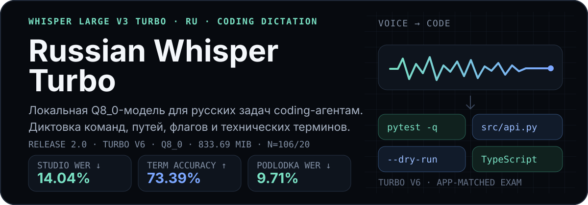

<p align="center">
  
</p>

<p align="center">
  <code>GGML</code> · <code>Q8_0</code> · <code>ru</code> · <code>Whisper Large V3 Turbo</code> · <code>833.69 MiB</code> · <code>релиз v2.0.0</code>
</p>

<p align="center">
  <a href="https://github.com/kalpakprod/russian-whisper-turbo/releases/download/v2.0.0/handy-whisper-large-v3-turbo-ru-coding-agent-q8_0.bin"><strong>Скачать модель</strong></a>
  ·
  <a href="#установка">Установка</a>
  ·
  <a href="./evaluation.json">Машинные метрики</a>
  ·
  <a href="./legacy/v1/README.md">Legacy v1.0.0</a>
</p>

## Что это

- Локальная модель русской диктовки для coding-агентов: один готовый файл для движка `whisper.cpp`, Python, PEFT и LoRA-папка для запуска не нужны.
- Основа: `openai/whisper-large-v3-turbo`; релиз содержит дообученную версию Turbo v6.
- Модель обучена сохранять то, что общая ASR портит чаще всего: латинские инструменты, CLI-флаги, пути, имена файлов, идентификаторы и отрицания.

  ```text
  «сначала запусти пайтест минус ку»
  → «Сначала запусти pytest -q.»

  «открой эс ар си слэш эй пи ай точка пи уай»
  → «Открой src/api.py.»

  «не делай гит ресет хард»
  → «Не делай git reset --hard.»
  ```

- Примеры целевого формата, не отдельный измеренный прогон v6.

## Результаты Turbo v6

- Студия, 106 фраз: WER 14.04%, точность терминов 73.39%, runaway 0.
- Podlodka, 20 фрагментов: WER 9.71%, точность терминов 52.63%, runaway 0.
- Общие наборы, WER: FLEURS ru 6.60% (192 уникальных ключа), FLEURS en 6.27% (164 ключа), Common Voice ru 7.01% (200 ключей; в старых манифестах дубли, поэтому покрытие предварительное).
- Против Turbo без дообучения, изменение WER в процентных пунктах: Podlodka -1.40, Common Voice ru -1.26, FLEURS ru +0.13, FLEURS en -0.02.
- Полный машинный протокол: [`evaluation.json`](./evaluation.json).

### Сравнение с прежней установленной моделью

- Прежняя релизная модель Legacy R48 на том же студийном экзамене с тем же декодером приложения: WER 30.8%, термины 35.8%; v6: WER 14.04%, термины 73.39%.
- Это точечное сравнение с одной строкой benchmark-замера: доверительный интервал для этой пары не считался, универсальным доказательством оно не служит.
- Термины 35.8% записаны по приближённой старой строке; точное значение есть только у v6.

### Чего эти цифры не доказывают

- Студийный тест записан тем же голосом и в той же сессии, что тренировочные фразы.
- Обучающие фрагменты Podlodka взяты из других выпусков, чем экзаменационные, но ведущие и шоу те же, поэтому часть выигрыша может быть привыканием к этому подкасту.
- Независимой проверки на живых диктовках владельца нет; модель не заявляется как универсально лучшая русская ASR.
- Старый тест 300 синтетических команд (WER 8.35% у Legacy) это другой экзамен; сравнивать его с 14.04% нельзя, аудио теста не сохранилось.

## Установка

- Handy работает на движке `whisper.cpp`; модель кладётся в `%APPDATA%\com.pais.handy\models\`.
- Скачивание и проверка хеша в PowerShell (ссылка закреплена за релизом v2.0.0):

  ```powershell
  $modelDir = Join-Path $env:APPDATA "com.pais.handy\models"
  $modelName = "handy-whisper-large-v3-turbo-ru-coding-agent-q8_0.bin"
  $modelPath = Join-Path $modelDir $modelName
  $url = "https://github.com/kalpakprod/russian-whisper-turbo/releases/download/v2.0.0/$modelName"

  New-Item -ItemType Directory -Force -Path $modelDir | Out-Null
  Invoke-WebRequest -Uri $url -OutFile $modelPath
  (Get-FileHash -Algorithm SHA256 $modelPath).Hash
  ```

- Ожидаемый SHA-256 v2.0.0:

  ```text
  eb05b341f8d47a16e554464175529951ba5b94937d6afc8d63e26041ea326ce5
  ```

- То же в Linux:

  ```bash
  curl -LO "https://github.com/kalpakprod/russian-whisper-turbo/releases/download/v2.0.0/handy-whisper-large-v3-turbo-ru-coding-agent-q8_0.bin"
  sha256sum handy-whisper-large-v3-turbo-ru-coding-agent-q8_0.bin
  ```

- Перезапустите Handy и выберите модель `handy-whisper-large-v3-turbo-ru-coding-agent-q8_0`.
- Вручную: скачайте `.bin` из [релиза v2.0.0](https://github.com/kalpakprod/russian-whisper-turbo/releases/download/v2.0.0/handy-whisper-large-v3-turbo-ru-coding-agent-q8_0.bin), положите в `%APPDATA%\com.pais.handy\models\`, перезапустите Handy и выберите модель по имени файла.

### Совместимость и осторожность

- Движок одинаковый (`whisper.cpp`); реальный сервер OpenWhispr загружал файл модели (сборка Vulkan, health 200).
- Полный тест диктовки через UI Handy на релизе v2.0.0 не выполнялся.
- Модель не устанавливает и не меняет настройки OpenWhispr автоматически; автоматическое обнаружение моделей приложением не заявляется.

## Обучение и данные

- Метод: LoRA на декодере (attention и MLP), rank 32, alpha 64, dropout 0.05; encoder заморожен.
- Режим: fp32, lr 1e-4, 3 эпохи.
- Данные: 112 реальных студийных фраз владельца, каждая повторена 10 раз, плюс 264 человеческих replay-записи (140 Common Voice, 103 FLEURS, 21 Podlodka).
- Личный голос использован: да, студийными фразами; ни одна из 2265 накопленных живых диктовок владельца в обучение не вошла, их тексты не проверены.
- Приватные аудио и тексты не публикуются; рецепт и протокол оценки: [`release-v2/TRAINING.md`](./release-v2/TRAINING.md).

## Выбор версии

- Две финализационные дообучения не превзошли v6; в релиз вошла именно v6.
- Кандидат на 2 эпохах совпал с v6 в пределах статистики: студия +1.02 [-1.09; +3.20], Podlodka +0.52 [-0.58; +1.52]; по правилу ничьей оставлена v6.
- Метрики кандидата к v6 не относятся; подробности: [`release-v2/MODEL-CARD.md`](./release-v2/MODEL-CARD.md).

## Спецификация артефакта

- Файл: `handy-whisper-large-v3-turbo-ru-coding-agent-q8_0.bin`, формат `whisper.cpp` GGML, квантование `Q8_0`.
- Размер: 874 188 075 байт (833.69 MiB).
- Базовая модель: `openai/whisper-large-v3-turbo`.
- SHA-256: `eb05b341f8d47a16e554464175529951ba5b94937d6afc8d63e26041ea326ce5`.

## Ограничения и условия

- Целевой режим: русские диктовки coding-агентам; английская речь и универсальная транскрипция не оптимизировались.
- Базовая модель опубликована под [MIT](https://huggingface.co/openai/whisper-large-v3-turbo/blob/main/README.md); для дообученных весов и наборов данных единой лицензии не присваивается, условия нужно проверять отдельно.
- Условия Legacy (Apache-2.0 базы coriollon и условия TTS-источников) относятся только к релизу v1.0.0 и на v6 не переносятся.
- Воспроизвести обучение по публичным данным нельзя: студийное аудио приватно. Код тренера находится в отдельном рабочем проекте и в этом релизе не опубликован.

## Legacy v1.0.0

- Прежняя модель на `coriollon/whisper-large-v3-turbo-russian` переименована в Legacy и доступна в теге [v1.0.0](https://github.com/kalpakprod/russian-whisper-turbo/releases/tag/v1.0.0).
- Её исходные README и метрики сохранены без изменений: [`legacy/v1/README.md`](./legacy/v1/README.md), [`legacy/v1/evaluation.json`](./legacy/v1/evaluation.json).
- Все таблицы Legacy (domain test 8.35%, проверка Q8_0 против F16, внешние наборы, сравнение с Podlodka, история R48) относятся только к Legacy и на v6 не переносятся.
- Артефакт v2.0.0 носит то же имя файла, что и v1.0.0, но имеет новый хеш; скачивайте по закреплённой ссылке релиза v2.0.0 из раздела «Установка».
- Ссылки внутри архивного README могут вести на последний релиз: инструкции покажут старый хеш, а скачается новый файл; скачивайте Legacy только по закреплённой ссылке [релиза v1.0.0](https://github.com/kalpakprod/russian-whisper-turbo/releases/tag/v1.0.0).
